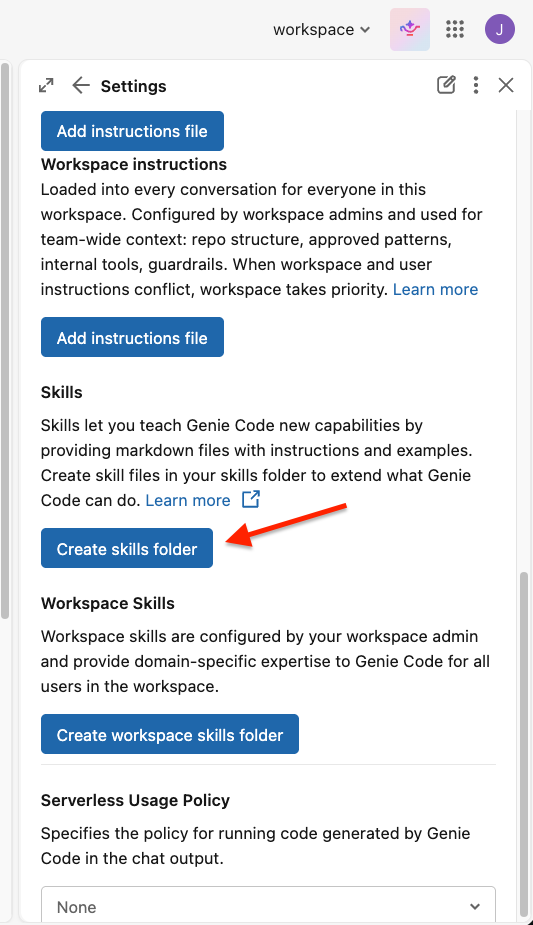

# Databricks MLOps Quickstart

> [YouTube video: watch now!](https://www.youtube.com/watch?v=8lUbYTXJHe4)


This is a simple end-to-end example of a Databricks MLOps project that uses the [Iris Dataset](https://scikit-learn.org/1.4/auto_examples/datasets/plot_iris_dataset.html).  
The goal of this project is to create a model that allows you to automatically classify flowers into different species based on their properties, and to have a [CI/CD](https://en.wikipedia.org/wiki/CI/CD) pipeline enabled that will allow you to easily track and deploy your code to different environments, such as Development and Production.  

As a part of this project, you will set up:
- A job for ingesting the Iris data into a feature table
- A job for training a simple classification model and storing the model in the Unity Catalog
- A job that uses the model to run inferences on the top of newly collected (unidentified) flowers
- An MLflow 3 deployment job for automating the process of defining the model used for running the production inferences

In the "Notebooks" folder, you'll find [0_CopySkillsToUsersFolder.ipynb](notebooks/0_CopySkillsToUsersFolder.ipynb) and three groups of Python notebooks. Run the setup notebook first if you plan to use Genie Code to adapt this template (see [Adapt this template with Genie Code](#adapt-this-template-with-genie-code) below).
1. **DataPreprocessing**: these are the notebooks that are used in the data preprocessing job. Within the "resources" folder, you will find a workflow called "1_data_preprocessing_job.yml" that basically triggers a simple data preprocessing notebook. This is just an example - we would certainly have additional notebooks for multi-stage preprocessing (e.g. source->bronze, bronze->silver, silver->gold).
2. **ModelTrainingAndDeployment**: 
  - The "model_training.ipynb" notebook is used in the "2_1_model_training_job.yml" job, which can be found in the "resources" folder. It features the code to train a simple classification model and save it to the Unity Catalog. It is important to mention that this model should be registered with the *Challenger* alias every time it gets trained. *Challenger* is a term that is used to define a model that has the potential of becoming the official model for running inferences, but not necessarily will become it, unless formally validated. 
  - The "1_model_evaluation.ipynb", "2_model_approval.ipynb" and "3_model_deployment.ipynb" notebooks (under "model_deployment/") are a part of the "2_2_model_deployment_job.yml" workflow, which can be found in the "resources" folder. These notebooks and job were inspired by the [Deployment Jobs](https://docs.databricks.com/gcp/en/mlflow/deployment-job) concept, introduced in MLflow 3. The idea is to add a series of steps that include metrics evaluation and human-in-the-loop approval before effectively deploying a model for production usage (or making it the *Champion* model, for instance). As an important note: after you save the first version of your model to the UC, you need to [connect your model to the deployment job](https://docs.databricks.com/gcp/en/mlflow/deployment-job#connect-the-deployment-job-to-a-model). The deployment job itself already automatically does that when you run it for the first time, in notebook [1_model_evaluation.ipynb](notebooks/2_model_training_and_deployment/model_deployment/1_model_evaluation.ipynb).
  

3. **Inference**: 
  - The "batch_inference.ipynb" notebook is used in the "3_batch_inference_job.yml" job, which can be found in the "resources" folder. It is a simple job that uses the *Champion* model for running batch inference on the top of new Iris samples and save the results to an Inference Table. 
  - The "realtime_inference.ipynb" notebook is just there to show an example of how you can use a Serving Endpoint that is connected to your *Champion* model to run inferences in near-real-time (note: this serving endpoint gets created programatically in the "3_model_deployment.ipynb" notebook)

This is not the focus of this demo, but you will notice that the jobs "1_data_preprocessing_job.yml", "2_1_model_training_job.yml", and "3_batch_inference_job.yml" have a commented **job compute** setting, although I haven't specified a specific compute setting in any job. Jobs without a compute setting in their DAB templates will automatically default to serverless. Both compute approaches offer significant cost advantages: dedicated job clusters can reduce costs by up to 3x (as of the first release date of this Repository) versus interactive compute, while serverless provides scalable usage-based pricing that's entirely managed by Databricks. I definitely recommend checking out our [pricing page](https://www.databricks.com/product/pricing), as well as our [compute documentation](https://docs.databricks.com/aws/en/compute/) for more accurate and updated info on pricing!  

Now, talking about the other elements from this repository in more depth:
  - The file **databricks.yml** is a file that defines how to deploy all of these jobs in an automatic fashion using [Databricks Asset Bundles](https://docs.databricks.com/aws/en/dev-tools/bundles/). The jobs will be parameterized based on whether they are *development* or *production* jobs. By running a simple ```databricks bundle deploy --target <dev, prod>``` command, all of those jobs should be automatically created within your workspace (provided you have the necessary permissions to create these resources), pointing to the right resources depending on each environment. Note that you can set different permissions to the objects depending on the environment that you're in! 
  - The file **.github/workflows/databricks_deployment.yml** specifies the *Continuous Deployment (CD)* piece of our work if you use GitHub as your CI/CD tool. You can set up commands to run whenever changes occur to your codebase by leveraging [GitHub Actions](https://github.com/features/actions). For instance, if a push occurs to the dev branch of this repository, the command `databricks bundle deploy --target dev` will run automatically; and if a push is made to the main branch, the `databricks bundle deploy --target prod` command will get executed. 
  - The file **azure_pipelines.yml** specifies the *Continuous Deployment (CD)* piece of our work if you use Azure DevOps as your CI/CD tool. You can set up commands to run whenever changes occur to your codebase by leveraging [Pipelines](https://azure.microsoft.com/en-us/products/devops/pipelines). For instance, if a push occurs to the *dev* branch of this repository, the command `databricks bundle deploy --target dev` will run automatically; and if a pull request is made to the *master* branch, the `databricks bundle deploy --target prod` command will get executed. 

Having a *Continuous Deployment (CD)* pipeline enabled means that if you make any changes to your dev branch, your dev pipelines will be updated; and if you make any changes to your master branch, your prod pipelines will be automatically updated. 

  

**Wrap up:** as a part of this demo, you have created notebooks and jobs for a fictional MLOps end-to-end pipeline. By connecting your dev and prod workspaces and preparing your CI/CD setup, you will be able to deploy automatic updates to your Dev and Prod environments with a click of a button! Below, you can check the list of jobs that will get created in the demo, which can be easily filtered by using the tag **Project**: "mlops-quickstart".  

  
  
## Notes
 - If you want to clone this Repo to reproduce it on your end, don't forget to set the **host** (see the `TODO` comment under each target's `workspace` block) and change **catalog_name** in the [databricks.yml](databricks.yml) file, and: 
     - If you are using GitHub Actions, you need to add 2 Secrets called **DATABRICKS_CLIENT_ID** and **DATABRICKS_CLIENT_SECRET** with your service principal authentication details and also update the **WORKSPACE_HOST_NAME** secret in the [.github/workflows/databricks_deployment.yml](.github/workflows/databricks_deployment.yml) file; 
     - If you use Azure DevOps, then you also have to add these 2 parameters as pipeline secrets (**DATABRICKS_CLIENT_ID** and **DATABRICKS_CLIENT_SECRET**), and update the **WORKSPACE_HOST_NAME** variable in the [azure_pipelines.yml](azure_pipelines.yml) file. 
 - For this simple tutorial, we are using the same workspace and service principal for Dev and Prod, for the simplicity of demonstrating it. Make sure to check our documentation for more details on authentication and on how to manage different environments! 
 - Before deploying, search the repo for `TODO` and address each one — they mark every spot that needs your input to turn this from a demo into your own project: the workspace **host** and **catalog_name**/**schema_name** in [databricks.yml](databricks.yml), the commented-out permissions blocks per environment, and the commented-out `email_notifications` block in each job YAML under [resources/](resources/) (uncomment and set your own address once you're ready for failure alerts).

## Dependencies

All Python library versions are pinned in [`requirements.txt`](requirements.txt) at the repo root. Each notebook's first executable cell installs from that single file:

```python
%pip install -r ../../requirements.txt   # or ../../../ for deployment notebooks
dbutils.library.restartPython()
```

To bump a library, change the version once in `requirements.txt` — every notebook and job picks it up automatically. There is no need to edit version pins per notebook anymore.

## Adapt this template with Genie Code

This repo ships with [Genie Code agent skills](https://docs.databricks.com/aws/en/genie-code/skills) under [`.assistant/skills/`](.assistant/skills/) so the Databricks Assistant can walk you through adapting the template to your own data, model, and inference pipelines. Each skill is narrowly scoped, and the assistant loads it automatically when relevant:

| Skill | Use when you want to… |
|-------|----------------------|
| [`mlops-quickstart-overview`](.assistant/skills/mlops-quickstart-overview/SKILL.md) | Understand the repo structure, parameterization contract, and Challenger/Champion conventions. |
| [`adapt-data-ingestion`](.assistant/skills/adapt-data-ingestion/SKILL.md) | Replace the Iris dataset with your own source (cloud storage, JDBC, API, Delta, streaming, bronze/silver/gold). |
| [`adapt-model-training`](.assistant/skills/adapt-model-training/SKILL.md) | Swap the algorithm, features, target, or metrics for a new problem type (regression, clustering, forecasting, …). |
| [`adapt-model-deployment`](.assistant/skills/adapt-model-deployment/SKILL.md) | Customize the MLflow 3 *evaluate → approve → deploy* pipeline and serving endpoint. |
| [`adapt-inference`](.assistant/skills/adapt-inference/SKILL.md) | Adapt batch scoring and the realtime serving endpoint to your model and input schema. |
| [`adapt-bundle-and-cicd`](.assistant/skills/adapt-bundle-and-cicd/SKILL.md) | Adjust `databricks.yml`, job YAMLs, add a staging target, or wire up Azure DevOps / GitHub Actions secrets. |
| [`manage-dependencies`](.assistant/skills/manage-dependencies/SKILL.md) | Add, pin, upgrade, or troubleshoot Python libraries via `requirements.txt`. |

Before you start adapting the project, run [0_CopySkillsToUsersFolder.ipynb](notebooks/0_CopySkillsToUsersFolder.ipynb). It copies every skill from this repo into your personal skills folder at `/Users/{username}/.assistant/skills/`, which is where Genie Code looks for user skills. Run it once per workspace after you deploy or clone the project.

If you have never set up user skills in this workspace before, open Genie Code, go to **Settings**, and click **Create skills folder** first:



After that, run the notebook and Genie Code will pick up the skills the next time you use it. Start a new chat thread if you already had one open. You can also `@` mention a skill to use it on demand. See the [Genie Code skills docs](https://docs.databricks.com/aws/en/genie-code/skills) for full details.

## Learn more
 - Check out the [Big Book of MLOps](https://www.databricks.com/resources/ebook/the-big-book-of-mlops).
 - Here you can find more info on how to manage different environments for MLOps: [MLOps Workflows](https://docs.databricks.com/aws/en/machine-learning/mlops/mlops-workflow).
 - If you don't want to retrain your models in each environment, you can **promote** your models across environments. Check out this documentation for more info: [Promote a model across environments](https://docs.databricks.com/aws/en/machine-learning/manage-model-lifecycle#promote-a-model-across-environments).  
 - If you are interested in Unit, Integration, or User Acceptance Testing, I recommend watching the "Testing Strategies with Databricks" module of the [Advanced Machine Learning Operations](https://customer-academy.databricks.com/learn/courses/3508/advanced-machine-learning-operations) training, from the Databricks Academy. 
 - Want to vibe-code your Databricks solutions? Check out the [AI Dev Kit](https://github.com/databricks-solutions/ai-dev-kit)! You can use the skills implemented by it along with this repo to advance your solutions using AI-Driven Development.  
 - Check out the "MLOps Stacks" template for a more advanced implementation: [MLOps Stacks: model development process as code](https://docs.databricks.com/aws/en/machine-learning/mlops/mlops-stacks). It may be worth checking it as you mature and grow in your MLOps journey!

## Q&A
- **Can I specify who I want the approvers to be in my deployment job?** Yes, you restrict who has permissions to **APPLY TAGs** and also set a [governed tag policy](https://docs.databricks.com/aws/en/admin/governed-tags/) so only certain people are allowed to set a specific tag value (in this case, it will be the "approval" tag).
- **Can I get notified when there's a model to approve?** Yes, you can set up your deployment jobs to send an email notification upon job failures to the approvers. 

Let us know if you need support in your MLOps journey! 

## How to get help

Databricks support doesn't cover this content. For questions or bugs, please open a GitHub issue and the team will help on a best effort basis.

## License

&copy; 2025 Databricks, Inc. All rights reserved. The source in this notebook is provided subject to the Databricks License [https://databricks.com/db-license-source].  All included or referenced third party libraries are subject to the licenses set forth below.

| library                                | description             | license    | source                                              |
|----------------------------------------|-------------------------|------------|-----------------------------------------------------|
| scikit-learn                           | Machine learning library for Python | BSD-3-Clause | https://github.com/scikit-learn/scikit-learn |
| pandas                                 | Data manipulation and analysis library | BSD-3-Clause | https://github.com/pandas-dev/pandas |
| mlflow                                 | ML lifecycle management platform | Apache-2.0 | https://github.com/mlflow/mlflow |
| databricks-sdk                         | Databricks SDK for Python | Apache-2.0 | https://github.com/databricks/databricks-sdk-py |
